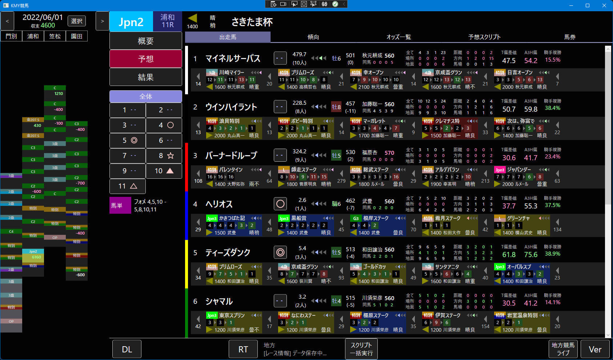

# KMY競馬

Windowsで動作するアプリです。



## 動作に必要なもの

現在バイナリは配布していないので、ビルドしないと起動できない状態です。
ITに関する専門知識のない方のご利用はお控えください。

### データベース

動作にはデータベースサーバーが必要です。`ROW_NUMBER`が使えるバージョンでなければいけません。
* MariaDB 10.2 以降
* MySQL 8 以降

インストール時にrootのパスワードを入力する画面が出ると思うので、そのパスワードを忘れずにメモしてください。

### 利用キー（有償）

競馬データの取得には、別途有償契約が必要です。（中央＋地方の場合、毎月約4000円）  
下記の片方または両方を契約しないと、競馬データが取得できません。

* [JRA-VANデータラボ会員](https://jra-van.jp/dlb/)
  * 中央競馬のデータ取得に必要です
  * 契約後、利用キーを取得してください。「JRAレーシングビュアー」は今のところ不要です
* [地方競馬DATA](https://saikyo.k-ba.com/members/chihou/)
  * 地方競馬のデータ取得に必要です
  * 契約後、利用キーを取得してください。利用キー以外にも多数の購入オプションがありますが全て不要です

利用キーは初期設定時に設定します。

### データ取得のためのソフト

起動そのものには不要ですが、ビルドの時に***両方***必要になります。

* [JV-Link](https://jra-van.jp/dlb/) - 「動作環境（JV-Link）」タブよりダウンロードできます
* [UmaConn](https://saikyo.k-ba.com/members/chihou/) - ダウンロードボタンよりダウンロードできます

利用キーを設定する必要がありますが、ビルドしてアプリを起動した後でも設定できます。

### 初期設定

`KmyKeiba` プロジェクトに `database.txt` というファイルがあります。

```
host=localhost
database=kmykeiba
username=root
password=takaki
```

これらの設定を変更して保存してください。ただし `username` は、データベース作成（`CREATE TABLE`）権限をもったものを設定してください。

また、アプリを起動した後、「ファイル」メニューよりJV-LinkとUmaConnの設定画面を開いて、利用キーを設定してください。

### 競馬データの取得

「ファイル」メニューより、最新データを取得します。ダイアログを閉じると、取得したデータが画面に反映されます。

## ビルド

.NET 5.0とC# 9で開発しているため、Visual Studio 2019以降が必要です。インストール時に、デスクトップアプリにチェックを入れてください。

### ビルドに必要なもの

ビルドには、上記「JV-Link」「UmaConn」の両方が必要です。

また、このリポジトリでは、著作権の関係で欠落しているファイルが存在しており、それがないとビルドできません。  
[Data Lab. SDK](https://jra-van.jp/dlb/sdv/sdk.html)よりSDK本体をダウンロードしてください。Ver.4.6.0では、以下のような構成になっています。

```
JV-Data構造体
JV-Link
サンプルプログラム
ドキュメント
```

このうち「JV-Data構造体」フォルダの中の「C#版」に含まれる `JVData_Struct.cs` ファイルを `structures.cs` にリネームのうえ、以下のディレクトリにコピーしてください。  
`JVLib` フォルダがない場合は作成してください。

```
KmyKeiba.JVLink/JVLib/structures.cs
```

さらに、 `structures.cs` を以下のように編集してください。

```c#
using System.Text;

#nullable disable

namespace KmyKeiba.JVLink.Wrappers.JVLib
{

    <ここに元々のstructures.csの内容を挿入>

}
```

### `Add-Migration` について

このプログラムはEntityFrameworkCoreを使用しています。`Add-Migration` を実行するときには、プロジェクトのソリューションプラットフォームを `Any CPU` にしてください。でないとエラーになります。

ただし、アプリを実行する時には必ず `x86` に戻してください。今度はJV-LinkとUmaConnのCOMが読み込まれなくなります。
